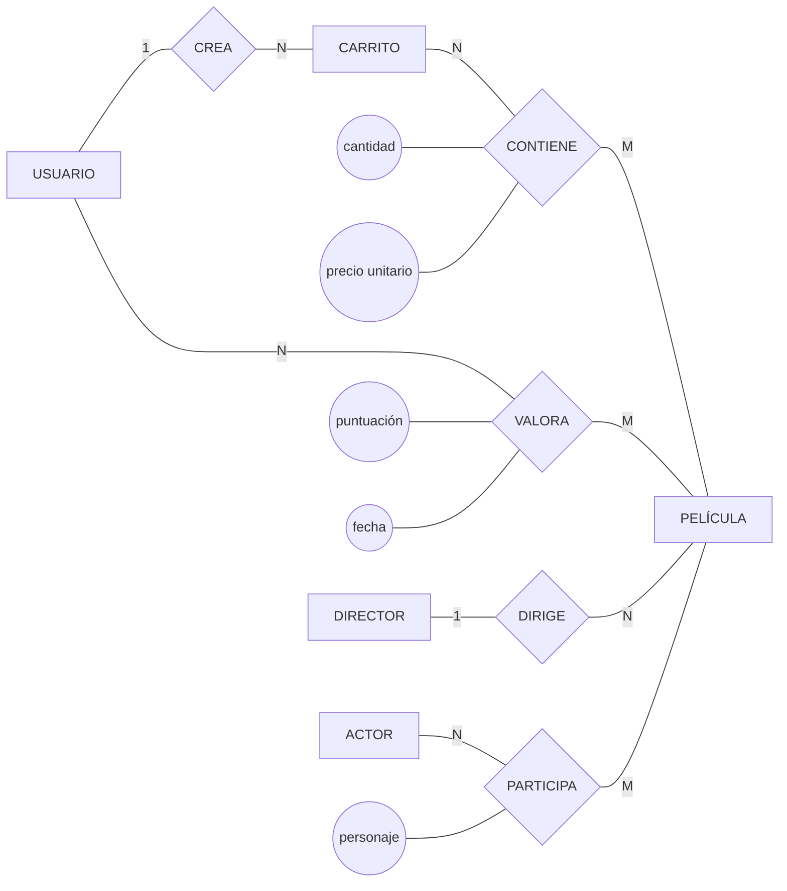
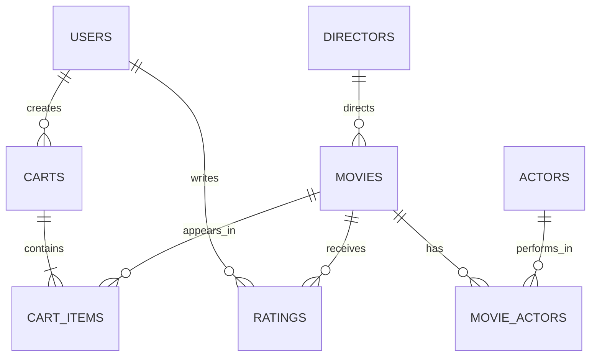

# Diseño inicial de la Práctica 2

Este documento recoge las decisiones previas a la implementación de `schema.sql`. El modelo usa PostgreSQL como única fuente de datos y será compartido por los dos microservicios.

## Entidades

### `users`

- `user_id`: identificador interno.
- `username`: nombre único.
- `password_hash`: contraseña almacenada mediante hash.
- `country`: nacionalidad utilizada por la consulta de ventas.
- `balance`: saldo disponible, nunca negativo.
- `session_version`: versión de sesión empleada para invalidar tokens sin guardar el token.
- `role`: permite reservar la creación y eliminación de películas a administradores.
- `created_at`: fecha de alta.

### `directors`

- `director_id`.
- `name`.
- `country`.

### `actors`

- `actor_id`.
- `name`.
- `country`.

### `movies`

- `movie_id`.
- `title`.
- `release_year`.
- `price`.
- `stock`.
- `director_id`: referencia al director.
- `created_at`.

### `movie_actors`

Relación muchos a muchos entre películas y actores.

### `carts`

- `cart_id`.
- `user_id`.
- `status`: `open`, `paid` o `cancelled`.
- `total`: importe mantenido automáticamente.
- `created_at`.
- `paid_at`: fecha de pago.

Cada usuario tendrá como máximo un carrito abierto.

### `cart_items`

- `cart_id`.
- `movie_id`.
- `quantity`.
- `unit_price`: conserva el precio que tenía la película cuando se añadió.

La clave primaria será `(cart_id, movie_id)` para impedir que una película aparezca duplicada dentro del mismo carrito.

### `ratings`

- `user_id`.
- `movie_id`.
- `score`: valor entre 0 y 10.
- `created_at`.

La clave `(user_id, movie_id)` garantiza un único voto por usuario y película.

## Diagrama entidad-relación conceptual

Las relaciones muchos a muchos `CONTIENE`, `VALORA` y `PARTICIPA` tienen atributos propios. Al transformar el modelo conceptual al modelo relacional se convierten, respectivamente, en `cart_items`, `ratings` y `movie_actors`.

## Paso al modelo relacional

## Triggers

1. Al insertar o aumentar un elemento del carrito se comprueba y reserva el stock.
2. Al eliminar o reducir un elemento se devuelve la diferencia al stock.
3. Después de modificar los elementos se recalcula el total del carrito.
4. Al cambiar un carrito de `open` a `paid` se comprueba el saldo, se descuenta el total y se asigna `paid_at`.
5. No se permite modificar un carrito que ya esté pagado o cancelado.

El stock se reserva al añadir una película. Esta decisión cumple el ejemplo del enunciado y evita vender más unidades de las disponibles.

## Procedimientos y funciones almacenadas

- Crear o recuperar el carrito abierto de un usuario.
- Añadir una película al carrito dentro de una única operación.
- Pagar el carrito de forma atómica.
- Calcular la valoración media de una película.
- Recuperar las ventas de un año y país.

La API llamará a cada operación compleja con un único `execute()`, tal como exige el enunciado.

## Token de sesión

El token incluirá el identificador del usuario y `session_version`, y estará firmado con un secreto compartido. El token completo no se guardará en PostgreSQL. Al hacer login o logout se incrementará `session_version`, invalidando cualquier token anterior.

## Endpoints propuestos

### Servicio `user.py`

| Método | Ruta | Operación |
| --- | --- | --- |
| `PUT` | `/user` | Crear usuario |
| `DELETE` | `/user` | Borrar el usuario autenticado |
| `POST` | `/user/login` | Iniciar sesión y emitir token |
| `POST` | `/user/logout` | Invalidar el token actual |
| `PATCH` | `/user/balance` | Recargar saldo |

### Servicio `api.py`

| Método | Ruta | Operación |
| --- | --- | --- |
| `PUT` | `/movies` | Crear una película |
| `DELETE` | `/movies/<movie_id>` | Borrar una película |
| `GET` | `/movies` | Listar y filtrar películas |
| `POST` | `/cart/items` | Añadir una película al carrito |
| `POST` | `/cart/pay` | Pagar el carrito abierto |
| `PUT` | `/movies/<movie_id>/rating` | Crear o reemplazar un voto |
| `GET` | `/movies/<movie_id>/rating` | Consultar la puntuación media |
| `GET` | `/ventas/<year>/<country>` | Consultar ventas por año y país |

## Orden de implementación

1. Confirmar el modelo y las reglas anteriores.
2. Crear `schema.sql` con tablas, restricciones, triggers y funciones.
3. Crear `populate.sql` con usuarios, películas, directores, actores y compras ficticias.
4. Crear PostgreSQL y su volumen en `docker-compose.yml`.
5. Implementar `user.py` con SQLAlchemy Core asíncrono.
6. Implementar `api.py` con consultas parametrizadas y un solo `execute()` por consulta.
7. Crear `client.py` con casos correctos y de error.
8. Medir `/ventas/<year>/<country>` con `EXPLAIN`, añadir índices en `optimizacion.sql` y comparar resultados.
9. Preparar `memoria.pdf` y `P2.zip`.
